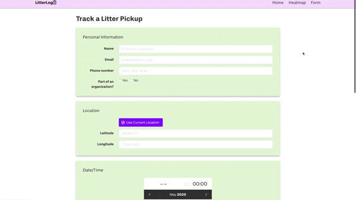

# LitterLog
### Track and visualize PG County litter

LitterLog is a web-based application created by University of Maryland students,
designed for tracking trash collection as well as logging any litter around 
Prince George's County.

With LitterLog, users can see the volume of trash that has been collected in PG 
County via the heatmap, or log any trash they encounter by using the form.

<p align="center">
  
</p>

## LitterLog Heroku Site

https://litter-logger.herokuapp.com/

## Target Browsers

LitterLog has been tested on the following desktop and mobile browsers:
- Chrome 81+
- Firefox 76+

Other browsers (Edge, Safari, w3m, etc.) are not supported at this time.

## Manual Links
[User Manual](https://github.com/gabekamalakis/morning-10/blob/develop/docs/user.md)

[Developer Manual](https://github.com/gabekamalakis/morning-10/tree/develop#developer-manual)

# Developer Manual

## Installation

### Getting started

Have an up-to-date version of Node.js: https://nodejs.org/

Clone this repository using your favorite shell
```
git clone https://github.com/gabekamalakis/morning-10.git
```

**OR** use GitHub Desktop

### Dependencies

While inside the application directory, install all node dependencies
```
npm install
```
This installs:
- bulma - CSS framework
- express - Node.js server framework
- mocha - JavaScript test framework
- sqlite, sqlite3 - SQL database backend
- babel - Access ES6+ JavaScript features
- node-fetch - Access fetch API
- nodemon - Restart node server while coding changes
- flatpickr - Datetime picker
- heatmap.js, leaflet-heatmap - Leaflet heatmap plugin
- autoprefixer, node-sass, postcss-cli - Edit and save Sass files
- npm-run-all - Run multiple npm scripts

## Deployment

Create /tmp directory within the application directory
```
mkdir tmp
```

Initialize empty database to write to
```
touch tmp/database.db
```

Start the application server
```
npm start
```

## Testing

## Server API

### Endpoints

## Known Bugs

## Future Road-map

## License
